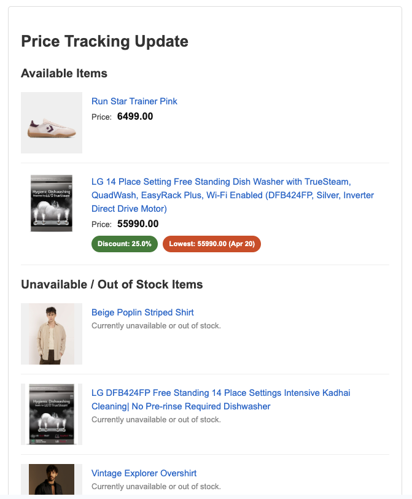

# Price Tracking Newsletter - Never Miss a Deal (Again!) ✨

This project scrapes product pages you list in a Notion database, checks for your preferred size (if applicable), grabs the current price and discount, and sends you a neat email summary.

  

This repository is set up as a template. Just click that shiny "Use this template" button above to create your own copy.

## Setup Guide:

1.  **Use This Template:** Click the "Use this template" button near the top of this page to create your own repository copy. Make it private if you're shy about your shopping list!

2.  **Notion Setup:**
    *   Create a new Notion database. Here's an [example database](https://www.notion.so/1dac5d7528be80b09035d7712347c730?v=1dac5d7528be816ba165000ccae7a483&pvs=4) you can duplicate and use as a starting point.
    *   Add a **Title** property (or any text property). This is where you'll paste the **full product URLs** you want to track. By default, the script looks for a property named `Urls`, but you can change this in `config.py` if you name it something else.
    *   Get your **Notion API Key**: Go to [Notion Integrations](https://www.notion.so/my-integrations), create a new integration, copy the "Internal Integration Token".
    *   Share your database with the integration you just created.
    *   Get your **Notion Database ID**: It's the long string of characters in your database URL between your workspace name (`.notion.so/`) and the `?v=...`. For the example database above, the ID is `1dac5d7528be80b09035d7712347c730`.

3.  **Gemini API Key:**
    *   You'll need a Google AI Gemini API key for the magic scraping part. Get one from [Google AI Studio](https://aistudio.google.com/app/apikey).

4.  **Email Setup:**
    *   You need to provide your email provider's **SMTP server** details and the **sender's email credentials** in the GitHub Secrets (see step 5).
    *   The defaults are set for Gmail (`smtp.gmail.com`, port `587`). If you use a different provider, update `SMTP_SERVER` and `SMTP_PORT` secrets accordingly.
    *   **If Using Gmail:**
        *   **If 2-Step Verification is OFF:** You *can* use your regular Google account password for the `SENDER_PASSWORD` secret. **However, this is strongly NOT recommended for security reasons.** Enabling 2-Step Verification and using an App Password is much safer.
        *   **If 2-Step Verification is ON (Recommended):** You need to create an **App Password**.
            *   Go to <https://myaccount.google.com/apppasswords> (you might need to sign in again).
            *   Enter a name for the app (e.g., "Price Tracker Script").
            *   Click "Create".
            *   **Copy the 16-character password displayed.** This is what you'll use for the `SENDER_PASSWORD` secret. *Do not use your regular Gmail password if you generate an App Password.*

5.  **GitHub Secrets:**
    *   In *your* new repository (the one you created from the template), go to Settings -> Secrets and variables -> Actions -> New repository secret.
    *   Add the following secrets:
        *   `NOTION_API_KEY`: Your Notion Integration Token.
        *   `NOTION_DATABASE_ID`: Your Notion Database ID.
        *   `GEMINI_API_KEY`: Your Google AI Gemini API Key.
        *   `SENDER_EMAIL`: The email address you're sending *from*.
        *   `SENDER_PASSWORD`: Your email account password OR the 16-character Gmail App Password (if using Gmail with 2FA).
        *   `RECIPIENT_EMAIL`: The email address you want to send the updates *to* (can be the same as `SENDER_EMAIL`).
        *   `SMTP_SERVER`: (Optional) Defaults to `smtp.gmail.com`. Change only if using a different provider.
        *   `SMTP_PORT`: (Optional) Defaults to `587`. Change only if using a different provider/port.

## How it Works & Customization ⚙️

*   **Automation:** Once you've set up the secrets, the included GitHub Actions workflow (`.github/workflows/price_tracker.yml`) will automatically run the script **every 3 days at midnight UTC**.
*   **Changing Frequency:** Want updates more or less often? Edit the `cron` schedule in the `.github/workflows/price_tracker.yml` file. Use [crontab.guru](https://crontab.guru/) to help figure out the syntax.
*   **Preferred Sizes:** Don't like the default sizes (`UK 9`, `S`, `30`)? Change `PREFERRED_SHOE_SIZE`, `PREFERRED_TOP_SIZE`, and `PREFERRED_BOTTOM_SIZE` in the `config.py` file.
*   **Run Manually:** You can also trigger the workflow manually from the Actions tab in your repository.

That's it! Add your URLs to Notion, sit back, and wait for the deals to roll into your inbox. Happy shopping (or saving)! 🎉